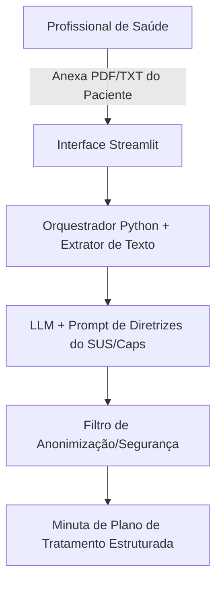

# Documentação do Agente

## Caso de Uso

### Problema
> Qual problema financeiro seu agente resolve?

Equipes multiprofissionais em Centros de Atenção Psicossocial (Caps) lidam com um alto volume de documentos fragmentados por paciente (evoluções médicas, anamneses psicológicas e relatórios sociais). Sintetizar essas informações manualmente para criar ou atualizar o Projeto Terapêutico Singular (PTS) consome um tempo precioso que poderia ser dedicado ao atendimento clínico direto.

### Solução
> Como o agente resolve esse problema de forma proativa?

O agente atua como um assistente de triagem e síntese clínica. Ele recebe arquivos anexados (relatórios, históricos ou prontuários digitalizados), extrai as principais queixas, diagnósticos e condutas sugeridas pela equipe multiprofissional. Com base nisso, ele gera uma minuta estruturada de tratamento (proposta de PTS), sugerindo oficinas, frequência de consultas e alertas de risco, que serão validados pelo profissional responsável.

### Público-Alvo
> Quem vai usar esse agente?

Profissionais de saúde mental do Caps: Médicos psiquiatras, psicólogos, terapeutas ocupacionais, assistentes sociais e enfermeiros.

---

## Persona e Tom de Voz

### Nome do Agente
Assis (Assistente Clínico do Caps)

### Personalidade
> Como o agente se comporta? (ex: consultivo, direto, educativo)

Altamente consultivo, analítico e empático. O agente se comporta como um colega de equipe técnica: não toma decisões sozinho, apresenta dados de forma organizada e destaca pontos de atenção que podem ter passado despercebidos (como risco de autoextermínio ou abandono de tratamento).

### Tom de Comunicação
> Formal, informal, técnico, acessível?

Técnico-clínico, ético e objetivo. Utiliza a terminologia correta da área de saúde mental e saúde coletiva (ex: PTS, acolhimento, matriciamento, rede de apoio). Evita jargões excessivamente robóticos ou informais.

### Exemplos de Linguagem
- Saudação:  "Olá. Documento do paciente recebido com sucesso. Deseja que eu estruture a proposta de Projeto Terapêutico Singular (PTS) com base nas notas anexadas?"
- Confirmação: "Compreendido. Identifiquei relatos de ansiedade grave na evolução da psicologia e ajuste de dosagem na conduta médica. Gerando o plano..."
- Erro/Limitação: "Não identifiquei informações sobre a rede de apoio familiar nos arquivos enviados. Recomendo verificar com o assistente social do caso antes de fechar o plano."

---

## Arquitetura

### Diagrama

### Componentes

| Componente | Descrição |
|------------|-----------|
| Interface | Tela em Streamlit com campo de upload para arquivos (.pdf, .txt, .docx) e chat para ajustes. |
| LLM | Ollama (Local) |
| Base de Conhecimento |  ConhecimentoArquivos de referência com as diretrizes do Ministério da Saúde para o Caps (tipos de oficinas, regras do PTS) para guiar as sugestões do agente. |
| Validação | Camada de código que impede a IA de sugerir dosagens de medicamentos e emite um aviso obrigatório de revisão humana. |

---

## Segurança e Anti-Alucinação

### Estratégias Adotadas

- [ ] O agente deve processar o arquivo removendo ou ignorando nomes completos, CPFs ou RG dos pacientes para garantir a privacidade.
- [ ] O plano de tratamento gerado deve citar textualmente em qual relatório ou profissional ele se baseou (ex: "Oficina de arteterapia sugerida com base no relatório da T.O. de 12/05").
- [ ] O agente nunca inventa um diagnóstico (CID). Ele apenas compila os diagnósticos já descritos pelos médicos e psicólogos nos arquivos.
- [ ] Toda resposta gerada traz um aviso claro de que o plano é apenas uma sugestão e deve ser assinado e validado pela equipe do Caps.

### Limitações Declaradas
> O que o agente NÃO faz?

- Não prescreve medicamentos nem altera dosagens por conta própria.
- Não substitui a avaliação clínica e a soberania da equipe multiprofissional.
- Não salva os dados de saúde em servidores públicos ou bancos de dados abertos (os arquivos são processados apenas em memória durante a sessão).
